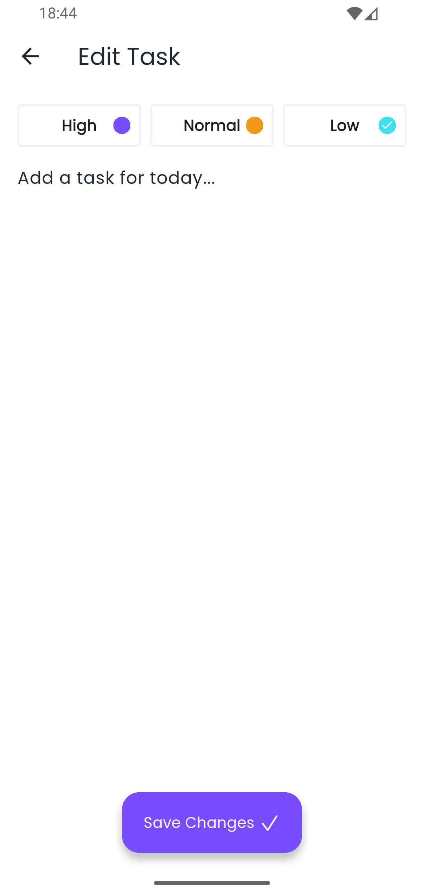

# Flutter To-Do List App (CRUD Example)

This is a **Flutter Application** developed for practicing **CRUD Operations** (Create, Read,
Update, Delete) on a local database stored on the user's device.  
The app uses **[Hive](https://pub.dev/packages/hive)**, a lightweight and fast **NoSQL DataBase**
for Flutter and Dart.

---

## 📱 Features

- Add new tasks with **priority levels**:
    - Low
    - Normal
    - High
- Mark tasks as **completed** (with strikethrough on the title).
- **Edit tasks** by tapping on them (update title or priority).
- **Delete a single task** by long-pressing it.
- **Delete all tasks** at once using the "Delete All" button.
- **Search tasks** by title.

---

## 🖼️ Screenshots

<p align="center">
  
  
</p>

<p align="center">
  
  
</p>

---

## 🚀 How to Run

1. Clone the repository or download the project files:
   ```bash
   git clone https://github.com/AmirhosseinHY/task-list-app
